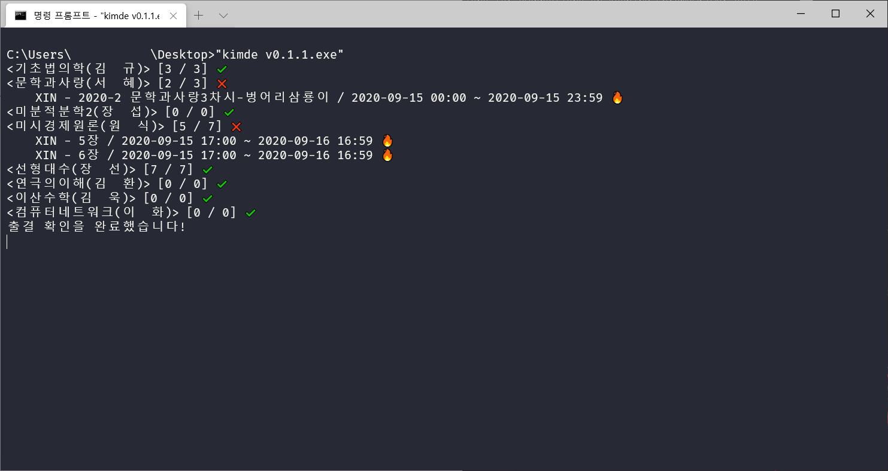
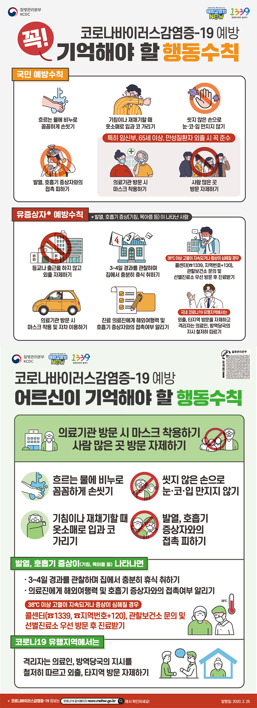

# KIMDE


[](https://www.gnu.org/licenses/gpl-3.0) [](https://www.rust-lang.org/)  []

***

## 소개



- KIMDE는 [한양대학교 블랙보드](https://learn.hanyang.ac.kr/) 출결 확인 프로그램입니다.
- 자동 출석 프로그램이 아닙니다.
- 개인정보를 수집하지 않습니다.
- GPLv3 라이선스로 배포됩니다.
- 사용시 발생하는 모든 문제의 책임은 실행한 사람에게 있습니다.

## 사용법

### 1. KIMDE 실행 파일 다운로드 혹은 빌드
- KIMDE는 크로스 플랫폼 프로그램입니다. Windows, Linux, macOS 등 다양한 환경에서 사용할 수 있습니다.
- 빌드된 실행 파일은 Windows에 한해 제공됩니다. [여기](bin)에서 다운로드 받을 수 있습니다.
- 다른 OS를 이용하거나 빌드된 실행 파일을 신뢰할 수 없는 경우 아래의 방법을 통해 직접 빌드해야 합니다. 위의 링크에서 실행 파일을 다운로드 받았다면 이 문단은 건너뛰어도 됩니다.

#### 윈도우에서 빌드하기

1. [rustup](https://win.rustup.rs)을 설치합니다.
2. [git](https://git-scm.com/download/win)을 설치합니다.
3. 원하는 폴더에서 터미널을 열고, `git clone https://github.com/POMMI3R/kimde && cd kimde && cargo build --release` 를 통해 저장소를 다운로드 및 빌드합니다.
4. `kimde/target/release`에 실행 파일이 생긴걸 볼 수 있습니다.

#### Linux, macOS에서 빌드하기

1. `curl https://sh.rustup.rs -sSf | sh`를 통해 rustup을 설치합니다.
2. 각자 OS에 맞는 방법으로 git을 설치합니다.
3. 원하는 폴더에서 터미널을 열고, `git clone https://github.com/POMMI3R/kimde && cd kimde && cargo build --release` 를 통해 저장소를 다운로드 및 빌드합니다.
4. `kimde/target/release`에 실행 파일이 생긴걸 볼 수 있습니다.

### 2. 웹드라이버 설치
- KIMDE는 웹드라이버를 사용해 출결을 한 번에 확인합니다.
- 다양한 웹드라이버를 사용할 수 있지만, 여기서는 `ChromeDriver`를 사용하는 예제를 보여줍니다.
- 우선 [Google Chrome](https://www.google.com/chrome/)을 설치합니다. 이미 설치되어 있다면, 최신 버전으로 업데이트해 줍니다. 현재 stable 최신 버전은 85입니다.
- 크롬 버전과 운영체제에 맞는 [Chrome Driver](https://chromedriver.chromium.org/downloads)를 다운받아, 적당한 곳에 압축을 풀어줍니다.

### 3. 설정 파일 작성
- KIMDE는 `config.toml` 파일을 사용해 아이디, 비밀번호 등의 설정을 관리합니다.
- `config.toml`은 한 번만 작성하면 됩니다.
- `config.toml`은 KIMDE 실행 파일과 같은 디렉토리에 있어야 합니다.
- 메모장 혹은 에디터를 열어 다음의 내용을 작성한 후, `config.toml`로 저장합니다.

```
port = 9515
id = "my_id"
password = "my_password"
semester = "2020년 2학기"
```

- `9515`는 `ChromeDriver`가 사용하는 포트 번호입니다. 다른 웹드라이버를 사용하려면 해당 웹드라이버의 포트 번호를 입력합니다.
- `id`와 `password`에는 자신의 블랙보드(한양대학교 포털) 아이디와 비밀번호를 입력합니다.
- `semester`에는 현재 학기를 입력해 줍니다. 블랙보드 코스에서 현재 학기를 확인할 수 있습니다.

### 4. 실행
- 1에서 다운받은 `chromedriver.exe`를 실행합니다.
- KIMDE 실행 파일을 실행합니다. 이 때 `config.toml`이 같은 디렉토리에 있어야 합니다.
- 최초 실행 시 몇 가지 정보를 `config.toml`에 캐싱하느라 시간이 오래 걸릴 수 있습니다. 느긋하게 기다려 주세요.
- 실행이 끝나면, `chromedriver.exe`를 종료합니다.

### 5. 설정 파일 관리(고급)

#### i. 출결 확인 제외하기
- 어떤 교수님들은 녹강 대신 실강만 진행합니다.
- `config.toml`을 편집해 해당 과목을 출결 확인에서 제외할 수 있습니다.
- 이 방법은 KIMDE를 1회 이상 실행한 이후에 사용할 수 있습니다.
- 다음은 `config.toml`의 예시입니다.

```
port = 9515
id = "my_id"
password = "my_password"
semester = "2020년 2학기"

[[course]]
id = "_11111_1"
name = "Take it slow"
prof = "아이린"

[[course]]
id = "_22222_2"
name = "Candy"
prof = "슬기"

[[course]]
id = "_33333_3"
name = "Light me up"
prof = "웬디"

[[course]]
id = "_44444_4"
name = "Cool world"
prof = "조이"

[[course]]
id = "_55555_5"
name = "Fool"
prof = "예리"
```

- 이 중에서 `조이` 교수님의 `Cool world` 과목의 출결을 확인하고 싶지 않으면, 해당 블록을 지워주시면 됩니다.
- 이제 `조이` 교수님과 실강으로 수업합니다. 만세!

```
port = 9515
id = "my_id"
password = "my_password"
semester = "2020년 2학기"

[[course]]
id = "_11111_1"
name = "Take it slow"
prof = "아이린"

[[course]]
id = "_22222_2"
name = "Candy"
prof = "슬기"

[[course]]
id = "_33333_3"
name = "Light me up"
prof = "웬디"

[[course]]
id = "_55555_5"
name = "Fool"
prof = "예리"
```

#### ii. Chrome 창 보이게 하기
* 검은 창 뒤에서 무슨 일이 진행되고 있는지 알고 싶을 때가 있습니다.
* `config.toml`에 `headless = false` 옵션을 추가해 주세요.

```
port = 9515
id = "my_id"
password = "my_password"
semester = "2020년 2학기"
headless = false
```

## 알려진 이슈

* macOS에서 `config.toml`을 찾지 못하는 문제가 있습니다. 나중에 나중에 돈을 많이 벌어서 맥을 사면 수정하겠습니다ㅠㅠ

## 자주 묻는 질문

Q1. 검은 창이 반짝 하고 닫혀요ㅠㅠ

A1. 검은 창이 반짝 하고 닫히는 것은 여러 원인이 있습니다. 다음의 사항들을 체크해 주세요.

1. `config.toml`을 잘 작성했나 확인해 주세요.
2. [확장자를 보이게 한 뒤](https://mainia.tistory.com/5104), `config.toml.txt`을 `config.toml`로 바꿔주세요.
3. 사용자가 직접 Chrome을 통해 로그인할 때, 비밀번호를 변경하라는 창이 뜨지 않는지 확인해 주세요. 3개월 이상 비밀번호를 바꾸지 않으면 실행되지 않는 것은 의도된 동작으로, 이렇게라도 비밀번호를 주기적으로 변경하게 하기 위함입니다.
4. 종료 후 다시 실행해 주세요. 크롬과 크롬 브라우저 버전이 85인지 확인해 주세요.


Q2. 5분 이상 실행했는데 반응이 없어요ㅠㅠ

A2. 종료 후 다시 실행해 주세요. 재차 반복해도 반응이 없으면 `config.toml`에 `headless = false` 옵션을 추가하고 어떤 창에서 멈추는지 캡쳐해서 제보해 주세요.

## 버그 제보, 의견
- 버그를 발견하거나 건의할 의견이 있다면, [카카오톡 오픈채팅](https://open.kakao.com/o/sSsjNIwc)으로 연락주세요.
- 다음은 버그의 예시입니다.
1. 프로그램 실행이 5분 이상 소요됨
2. 프로그램이 켜지자마자 닫힘
3. 프로그램을 실행할 수 없음
4. 블랙보드 상 출결과 다르게 나옴
- 혹은 과자를 사주셔도 됩니다.

## 도움 주신 분들

- `보드`님 버그 제보, 도네 감사합니다.
- `안냐세요`님 버그 제보 감사합니다.
- `박소희`님 도네 감사합니다.
- `감사합니당`님 도네 감사합니다.
- `20CSE`님 버그 제보 감사합니다.
- `카톡`님 도네 감사합니다.
- `C2H5OH`님 의견 제시, 도네 감사합니다.
- `카멜`님 버그 제보 감사합니다.
- 그 이외에 응원해 주신 모든 분들께 감사합니다.


## 릴리즈 노트

### v0.1.5
- `config.toml` 관련 오류 메시지가 상세해졌습니다.

### v0.1.4
- 이제 공지가 떠도 공지를 닫고 올바르게 동작합니다.
- `config.toml`의 `headless` 옵션을 통해 Chrome 창이 보여지게 할 수 있습니다.

### v0.1.3
- 이제 테이블 모드에서도 올바르게 동작합니다.

### v0.1.2
- 이제 Chrome 창이 표시되지 않습니다.
- ChromeDriver 이외의 웹드라이버를 사용하려면 소스를 수정해야 합니다.

### v0.1.1
- 종료 전에 엔터를 받습니다.

### v0.1.0
- 최초 릴리즈

## 코로나 안전수칙

